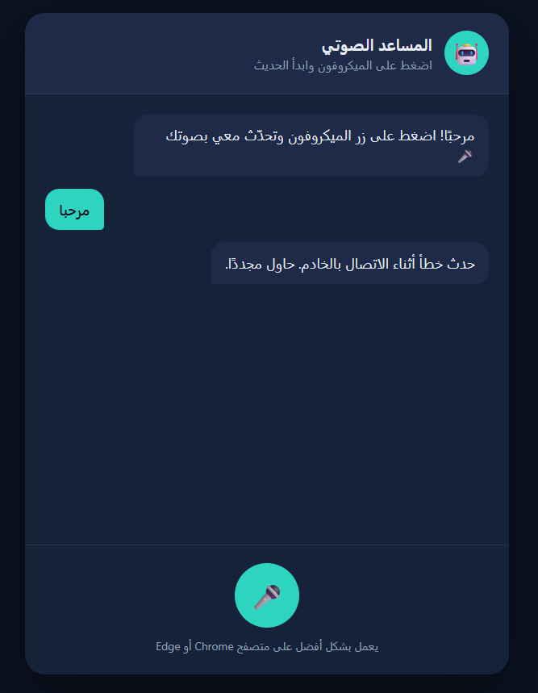
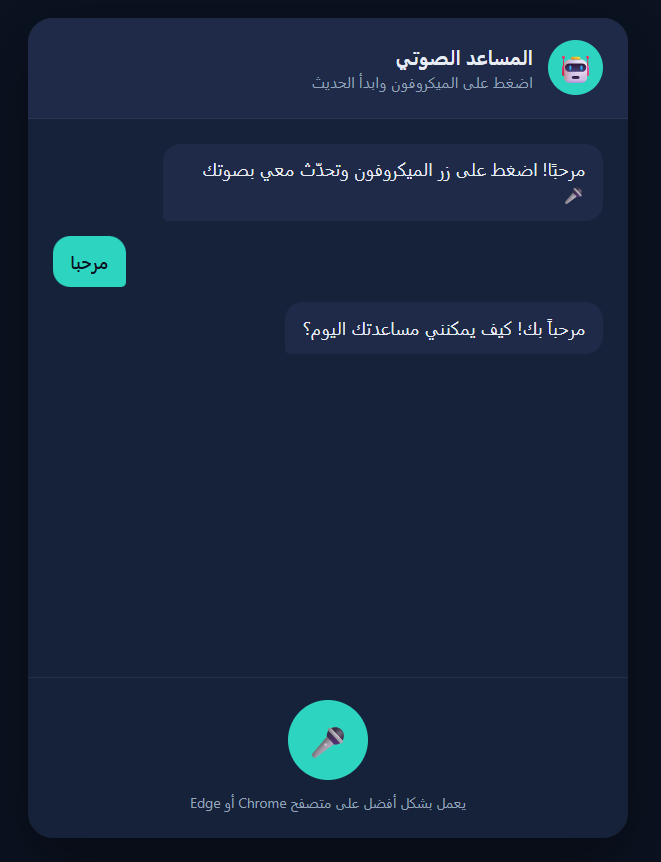

# 🤖Web-ChatBot

## Project Overview

This project involved troubleshooting and repairing a non-functional AI-powered online chatbot. Although the frontend interface loaded correctly, users were unable to receive responses due to multiple backend and deployment issues.

The objective was to identify each failure, determine its root cause, implement the necessary fixes, and restore full communication between the chatbot interface and the Google Gemini API.

---

# Problem Overview

The chatbot initially failed to respond to user messages because of several independent issues occurring at different layers of the application.

The major problems included:

* Incorrect backend file path
* Incorrect PHP configuration path
* Hosting provider blocking the backend file
* Missing Google Gemini API key
* Deprecated/unsupported Gemini AI model

Each issue was identified, verified, and resolved individually until the chatbot functioned correctly.

---

# Technologies Used

* HTML
* CSS
* JavaScript
* PHP
* Google Gemini API
* InfinityFree Hosting

---

# Debugging and Fix Process

## 1. Diagnosed the Initial Connection Failure

The first step was verifying that the frontend and backend files were correctly connected.

After inspecting the browser's Developer Tools (Network tab), the request returned a **404 Not Found** error.

### Cause

`app.js` was requesting:

```javascript
api/chat.php
```

However, the project did not contain an `api` directory. All project files were stored in the root folder.

---

## 2. Fixed the Backend File Path

The frontend was updated to point directly to the backend file.

### Before

```javascript
const BACKEND_URL = "api/chat.php";
```

### After

```javascript
const BACKEND_URL = "chat.php";
```

The PHP configuration path also required updating.

### Before

```php
require __DIR__ . '/../config.php';
```

### After

```php
require __DIR__ . '/config.php';
```

This resolved the missing file issue.

---

## 3. Resolved the 403 Forbidden Error

After fixing the file paths, requests no longer returned **404**, but instead produced a **403 Forbidden** response.

Using the browser's Network tools confirmed that the request was successfully reaching the server.

### Root Cause

The hosting provider (InfinityFree) blocks files named:

```
chat.php
```

This is a hosting-level restriction and was not caused by the application code.

---

## 4. Renamed the Backend File

To bypass the hosting restriction:

```
chat.php
```

was renamed to

```
ask.php
```

The frontend endpoint was updated accordingly.

### Before

```javascript
const BACKEND_URL = "chat.php";
```

### After

```javascript
const BACKEND_URL = "ask.php";
```

This completely removed the hosting restriction.

---

## 5. Added a Valid Gemini API Key

The chatbot still could not communicate with Google's API because the API key in `config.php` was empty.

### Before

```php
define('GEMINI_API_KEY', '');
```

A new API key was generated using Google AI Studio and inserted into the configuration file.

---

## 6. Updated the Gemini Model

The original project attempted to use an outdated Gemini model.

The application returned:

```
429 RESOURCE_EXHAUSTED
```

because the model had been retired and no longer provided free-tier quota.

A second model also returned:

```
404 Not Found
```

because it was unavailable for newly created API keys.

To determine the correct model, the available Gemini models were queried directly from the API.

The backend was then updated to use:

```php
$model = "gemini-flash-latest";
```

This alias always points to Google's recommended Flash model, making the chatbot more resilient to future model updates.

---

# Results

After applying all fixes:

* Frontend successfully communicates with the backend.
* Backend correctly loads the configuration.
* InfinityFree no longer blocks requests.
* Gemini API authentication succeeds.
* Supported Gemini model responds correctly.
* Chatbot generates responses as expected.

---

#Before & After Comparison

## Before Fix

The chatbot interface loaded successfully, but it was unable to generate responses due to backend configuration and deployment issues.

<p align="center">
  
</p>

---

## After Fix

After resolving the file path issues, hosting restrictions, API configuration, and Gemini model compatibility, the chatbot successfully communicates with the backend and generates AI responses.

<p align="center">
  
</p>

